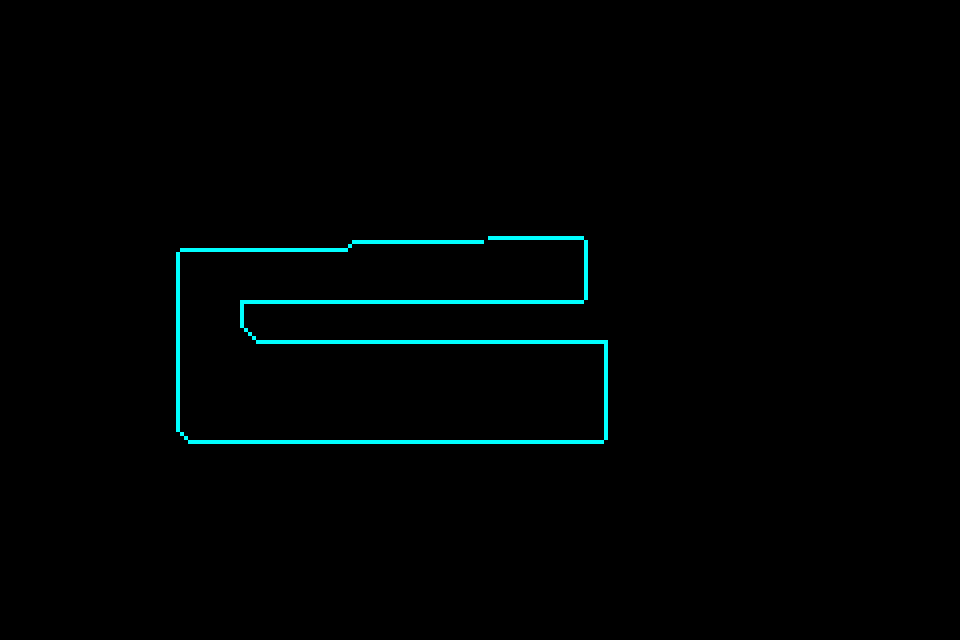

# Using Meson

Now that we have everything working, let's take a look at how to use the meson build system. The `game` directory has a pre-written `meson.build` file, which you can use if you want to jump right in, but it's pretty long, so for now, let's start really simple, with a basic build file:

```python
minrt = dependency('minrt')

elf = executable('guide-01', 'src/main.c',
  include_directories: ['include'],
  dependencies: [minrt],
  name_suffix: 'elf')

makerom = find_program('makerom')

rom = custom_target('guide-01-rom',
  input: elf,
  output: 'guide-01.gba',
  command: [makerom, '@INPUT@', '@OUTPUT@'],
  build_by_default: true)
```

1. We pull in dependencies (libraries that we want to use in our code) using the `dependency()` function.
2. We build our program as an ELF file using the `executable()` function.
3. We find external programs we want to use with `find_program()`.
4. We use `custom_target()` to add custom build steps (like turning our ELF into a GBA ROM).

Pretty straightforward, right?

Let's add a library, to help us use the GBA's hardware, [libseven](https://github.com/LunarLambda/sdk-seven/tree/main/libseven):

```python
# NEW!
libseven = dependency('libseven')
minrt = dependency('minrt')

elf = executable('guide-01', 'src/main.c',
  include_directories: ['include'],
  dependencies: [minrt, libseven], # <- NEW!
  name_suffix: 'elf')

makerom = find_program('makerom')

rom = custom_target('guide-01-rom',
  input: elf,
  output: 'guide-01.gba',
  command: [makerom, '@INPUT@', '@OUTPUT@'],
  build_by_default: true)
```

And write a basic program, that draws on the screen:

```c
#include <seven/prelude.h>
#include <seven/hw/video.h>
#include <seven/hw/video/bg_bitmap.h>
#include <seven/hw/video/color_constants.h>

int main(void)
{
    // To wait for V-Blank, we need some rudimentary interrupt handling
    irqInitStub();
    irqEnableFull(IRQ_VBLANK);

    // Enable video mode 3, which lets us draw pixels directly to the screen
    REG_DISPCNT = VIDEO_MODE(3) | VIDEO_BG2_ENABLE;

    struct InputState input = inputNew();

    int x = 120;
    int y = 60;

    // Our main game loop runs forever
    while (true)
    {
        // Process inputs
        input = inputPoll(input);
        x += inputAxisX(input);
        y += inputAxisY(input);

        // Make sure x and y stay on the screen (240x160 pixels)
        if (x < 0) x = 0;
        if (x >= 240) x = 239;

        if (y < 0) y = 0;
        if (y >= 160) y = 159;

        // Wait for V-Blank so we can draw to the screen without tearing
        biosVBlankIntrWait();

        // Draw a pixel to the screen
        MODE3_FRAME[y][x] = COLOR_CYAN;
    }
}
```

And if we run it... hey!

